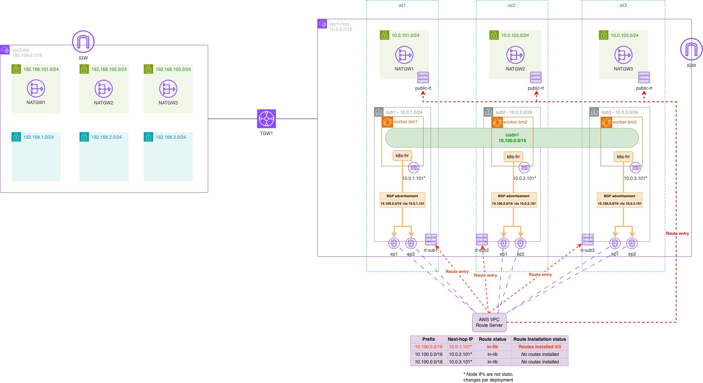

# Direct routing between ROSA Pod network and Amazon VPC
This example shows an approach to establish a **Layer 3 (L3) Direct Routing** topology, ensuring bidirectional, non-NATted communication between the OpenShift cluster's Pod Network and all surrounding AWS VPC networks.
This ensures KubeVirt VMs are treated as natively routable hosts within the Amazon VPC or other connected networks.
Configuration in this repository manages traffic flow across three distinct private network segments:
| Network Domain | CIDR Range | Role in the Topology |
| :--- | :--- | :--- |
| **Local AWS VPC** | `10.0.0.0/16` | Hosts the OpenShift cluster, worker nodes, and any local EC2 consumers. |
| **OpenShift Pod Network** | `10.100.0.0/16` | Hosts all Pods and KubeVirt VMs. 
| **External VPC** | `192.168.0.0/16` | An external network, connected via Transit Gateway, that needs direct access to the KubeVirt VMs. |
### Requirements
**Ingress:** External systems (in `10.0.0.0/16` or `192.168.0.0/16`) must send traffic directly to the VM's Pod IP (`10.100.x.x`) without address translation.

**Egress:** Traffic originating from the KubeVirt VM must exit cluster with the VM's original Pod IP (`10.100.x.x`) preserved as the source address.

# Approach

Using Amazon VPC Route Server to dynamically update subnet route tables and send traffic destined for Pod network (10.100.0.0/16) to ROSA worker node.
Routes will be populated to VPC Route Server via BGP protocol, leveraging frr-k8s on dedicated "router" worker nodes to conduct route advertisements (1 per AZ - 3 in total). 
VPC Route Server has an active BGP sessions and prefix from all 3 routing workers in RIB, but only one can be installed in FIB (subnet RTs). 
This means that only one routing node can be active as a router for Pod network at a time, but in case of an outage (tracked via bgp keepalive), VPC Route Server will adjust subnet RTs to route Pod network to the next surviving node, ensuring high availability. 

# Content of this repository
Deployment of ROSA and variours AWS infastructure componets, in summary
- vpc1 - Local VPC (for ROSA)
- vpc2 External VPC
- Both VPCs have 3 public and 3 private subnets, Internet Gateway and corresponding NATGWs are in place
- deploy ROSA HCP
- create 3 machinepools
    - tags: 
        bgp_router = true
        bgp_router_subnet = subnet{1-3}
- create VPC route server in Local VPC
    - associate with vpc1
    - set propagation to vpc1 route tables
    - deploy 6x RS endpoints in vpc1 - 2 in each private subnet
- waits for machinepools to spin up ec2 instances and grab their private IPs and instance IDs (via script)
    - create Route Server peers (node IP is needed)
- disable src/dst check for all instances with tag bgp_router=true (shell script calling awscli)
- create TGW
- associate TGW with both VPC, create attachments and routes
- configuration for k8s-frr to peer with VPC Route Server endpoints
- create *cudn1* namespace
- create CUDN *cluster-udn-prod* with subnet 10.100.0.0/16 (topology Layer2)
- Create route advertisement for CUDN

## Diagram
Target state will look like this


# Usage

### 1. Ensure you are logged in with both rosa cli and aws cli

```bash
aws sts get-caller-identity

rosa whoami
```
You should get an non-error output for both commands.

### 2. Clone this repo
```bash
git clone https://github.com/msemanrh/rosa-bgp.git
cd rosa-bgp
```

### 3. Review and adjust terraform.tfvars to your needs 

```bash
cp terraform.tfvars.example terraform.tfvars`
# Then edit terraform.tfvars
```

You might want to update at least "aws_region" and "owner" variable
```hcl
aws_region = "eu-central-1"

# Optional: override AZs if your account/region does not use a/b/c
# Example for ca-central-1: ["ca-central-1a", "ca-central-1b", "ca-central-1d"]
# azs = ["ca-central-1a", "ca-central-1b", "ca-central-1d"]

owner = "CHANGE-ME" # used as tag Owner = var.owner for AWS resources
project = "ROSA-Virt BGP" # used as tag Project = var.project for AWS resources
project_id = "-bgp" # Optional: appended to AWS resource names after owner for easier identification, e.g. name = "${var.owner}${var.project_id}-vpc1-rosa". If kept empty, then it will be omitted
# Additional tags applied to all AWS resources
tags = {
}

rosa_cluster_name = "myrosa1"
rosa_openshift_version = "4.20.0"
rosa_compute_instance_type = "c5.metal"
rosa_bgp_asn = "65003" # OCP AS number - used for k8s-frr config

vpc1-rosa_cidr = "10.0.0.0/16"
vpc1-rosa_private_subnets = ["10.0.1.0/24", "10.0.2.0/24", "10.0.3.0/24"]
vpc1-rosa_public_subnets = ["10.0.101.0/24", "10.0.102.0/24", "10.0.103.0/24"]
rs_amazon_side_asn = "65002" # AS number of route server

vpc2-ext_cidr = "192.168.0.0/16"
vpc2-ext_private_subnets = ["192.168.1.0/24", "192.168.2.0/24", "192.168.3.0/24"]
vpc2-ext_public_subnets = ["192.168.101.0/24", "192.168.102.0/24", "192.168.103.0/24"]
```


### 4. Apply terraform
```bash
terraform init
terraform apply
```

**Note**: The deployment automatically runs `scripts/disable_src_dst_check.sh` to disable source/destination checking on BGP router instances. By default, the script targets instances with tag `bgp_router=true` in region `eu-central-1`. To customize these values, set environment variables before running terraform:

```bash
export AWS_REGION="us-east-1"  # Override target region
export TAG_KEY="bgp_router"     # Override tag key (default: bgp_router)
export TAG_VALUE="true"         # Override tag value (default: true)
terraform apply
```

##### 4.1 (Optional) Have a coffee or tea
This will take a while... approx. 30-40min

### 5. Login to cluster
From terraform module directory, run following 
```bash
oc login $(terraform output -raw rosa_api_url) -u cluster-admin -p $(terraform output -raw rosa_cluster_admin_password)
```
Now we have base infra and ROSA cluster up & running, but baremetal workers might not be ready yet.
Let's wait for all 3 baremetal workers to become available
```bash
watch oc get nodes -l bgp_router=true
```

### 6. patch Network operator to enable route advertisements and add FRR config 
```bash
./oc-cudn-run1.sh
```
Note: If you get an error about openshift-frr-k8s namespace not available, just wait a bit and re-run the script

^^ This is just a quick hack, to be done in more "elegant" way later


### 7. Apply oc configs and install OpenShift Virtualization
Run oc apply on folder with yaml files to create CUDN:
```bash
oc apply -f yamls/
```
There are 3 yaml files:

_oc-apply-cudn1.yaml_ - create namespace **cudn1**

_oc-apply-cudn2.yaml_ - create CUDN **cluster-udn-prod**

_oc-apply-cudn3.yaml_ - Create route advertisement for CUDN

Now install OpenShift Virtualization:
```bash
./oc-virt-install.sh
```

This script will:
- Create the openshift-cnv namespace
- Subscribe to the kubevirt-hyperconverged operator
- Create the HyperConverged CR to enable all components
- Wait for the operator to be fully available (2-5 minutes)
- Verify the installation

**Note**: The installation may take several minutes. The script will show progress updates.


# 8. Use OpenShift Virtualization
OpenShift Virtualization is now installed and ready to use. You can create VMs in the `cudn1` namespace, and they will be directly accessible by their Pod IPs from both vpc1 and vpc2.

To access the cluster console and create VMs:
```bash
terraform output rosa_console_url
terraform output rosa_cluster_admin_password
```

To verify OpenShift Virtualization installation:
```bash
oc get hco -n openshift-cnv
oc get pods -n openshift-cnv
```

To disable automatic installation of OpenShift Virtualization, set in terraform.tfvars:
```hcl
install_openshift_virt = false
```


# 9. Clean up
Once finished, tear it down
```bash
terraform destroy
```
